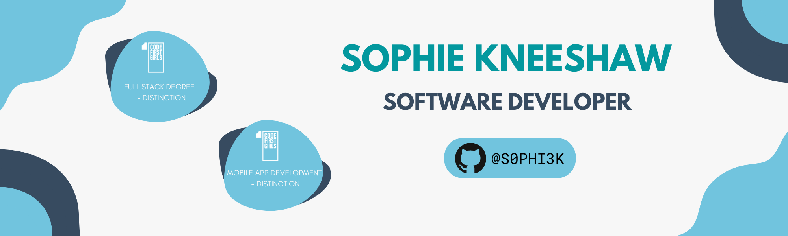

 

### Hello, I'm Sophie and welcome to my GitHub page. 👋

I transitioned into tech in May 2022.

💬 If you have any questions or feedback, please do not hesitate to reach out to me.

 

🎉 I have a keen interest in Frontend Development and I'm currently developing my technical skillset by:

 

- 💃 I'm currently a mentee at [Cajigo](http://www.structur3dpeople.co.uk/cajigo/)
- 🔭 I’m currently working on personal projects to improve my skill set.
- 🌱 I’m currently learning React hooks and redux through thge Code First Girls Mobile App Development course.
- 👯 I’m looking to collaborate on projects
- 🤔 I’m looking for help with improving the quality of my code and testing code.
- 💬 Ask me about my transition in tech from writing my first line of code in February 2022.
- 🎓 I'm a [Code First Girls](https://codefirstgirls.com/courses/cfgdegree/) Full Stack Developer Graduate, achieving 90% (Distinction)
- 👩‍🎓 I've just completed [Code First Girls](https://codefirstgirls.com/courses/masters/) Masters in Mobile App Development
- 😄 Pronouns: She/Her
- ⚡ Fun fact: One of my favourite concerts was seeing the Vengaboys in 2017 (controversial, I know!)

### 🤠Connect with me: 
 

### 💼 Technical Skills:

     
 

### 📄 Frameworks:

    
 

### 💻 Hosting:

 

### ⌨ IDEs/Editors:

  
 

### 🎨 Design Skills:

 
 

### 🏢 Education:

- +Masters Mobile App Development with [Code First Girls](https://codefirstgirls.com/courses/masters/)
- Full Stack Developer Degree with [Code First Girls](https://codefirstgirls.com/courses/cfgdegree/)
- Data & SQL MOOC Sprint with [Code First Girls](https://codefirstgirls.com/courses/moocs/)
- UX/UI MOOC Sprint with [Code First Girls](https://codefirstgirls.com/courses/moocs/)
- Bug Fixing MOOC Sprint with [Code First Girls](https://codefirstgirls.com/courses/moocs/)
- Python & Apps 8 Week Course with [Code First Girls](https://codefirstgirls.com/courses/classes/coding-kickstarter/)

   
 

### 📌 Project Links

+Masters Mobile App Development with Code First Girls. As a group we built a [Trade Finder App](https://github.com/Group4-MobileDevelopment-CFG/TradeFinderApp) using React Native Cli and Firebase. For a video demonstration of the project, click [here](https://youtu.be/guPy6ngv9-A).

Full Stack Developer Degree with Code First Girls. As a final group project we created a [Gluten Free Recipe Search App](https://github.com/sassaf1994/CFGProjectGroup7GlutenFree) using React. The backend was hosted through AWS and our database hosted through Heroku. For a video demonstration of the project, click [here](https://youtu.be/mdvzDYHeapU).

The Full Stack Developer degree was split into two sections. During the foundation section we learnt Python. Code snippets from this section can be found [here](https://github.com/S0PHI3K/Foundation).

The specialistion section focused on learning Javascript and React. Code snippets from this section can be found [here](https://github.com/S0PHI3K/Specialisation).

 

### 💻 Scrimba Projects

Projects feature netlify links to view apps in a web browser

React Section 1

- [Digitial Business Card](https://github.com/S0PHI3K/Digital-Business-Card)

React Section 2

- [Travel Solo Project](https://github.com/S0PHI3K/Scrimba-Travel-Solo-Project)
  Code along projects in section 2
- [Jokes Project](https://github.com/S0PHI3K/Scrimba-Joke-Project)
- [AirBnB Project](https://github.com/S0PHI3K/Scrimba-AirBnB-Project)

 

